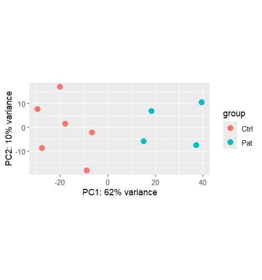
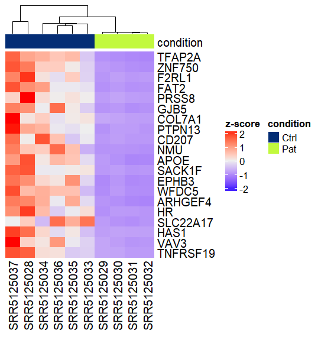
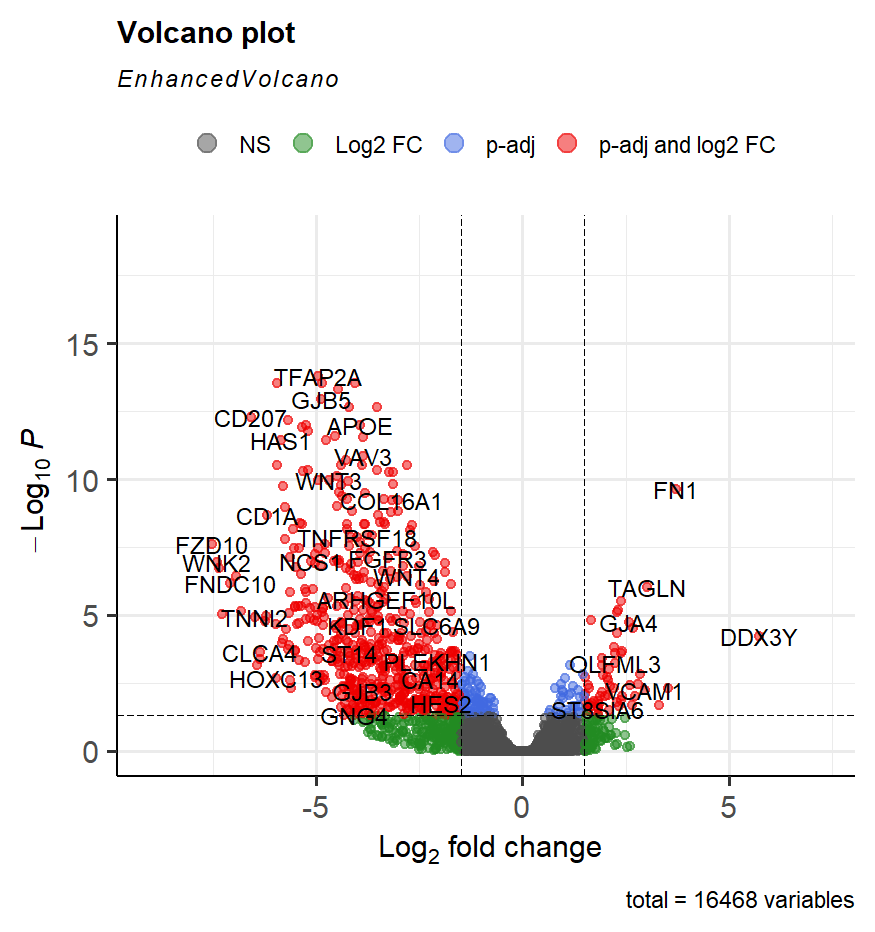
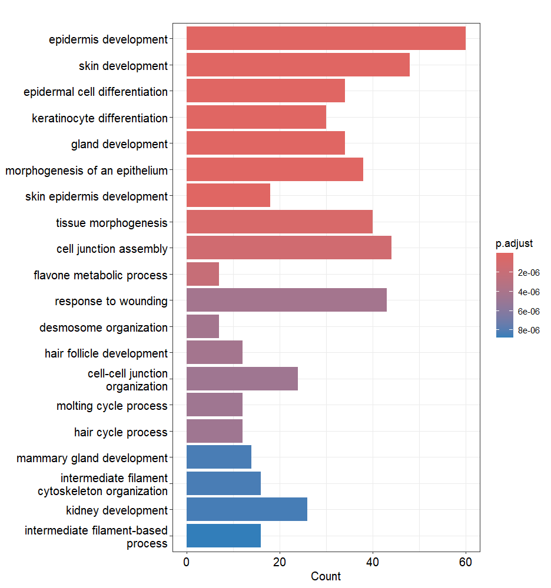

# DGEA-recount3

# RNA-seq Differential Expression & Functional Enrichment Pipeline

An end-to-end bulk RNA-seq analysis workflow in R, starting from public data on **recount3**, through differential expression testing with **DESeq2**, quality control, visualization, and functional enrichment.

**Dataset:** recount3 project `SRP095512` (human, GENCODE v26)
**Comparison:** Control vs. Patient (`Ctrl` vs `Pat`)

## What this script does

1. Pulls raw coverage data from recount3 and converts it to read counts
2. Builds a DESeq2 dataset and filters low-count genes
3. Runs differential expression testing (Wald test) with `apeglm` LFC shrinkage
4. QC via PCA to confirm sample clustering by condition
5. Annotates ENSEMBL IDs with gene symbols
6. Visualizes results: MA plots, heatmaps (pheatmap + ComplexHeatmap), volcano plots (ggplot2 + EnhancedVolcano)
7. Runs GO enrichment and GSEA on the resulting gene list

## Key Results

**PCA plot** 

**Heatmap** 

**Volcano plot** 

**GO enrichment** 

## Files

- `rnaseq-dgea-recount3.Rmd` — full annotated analysis script
- `figures/` — exported plots referenced above

